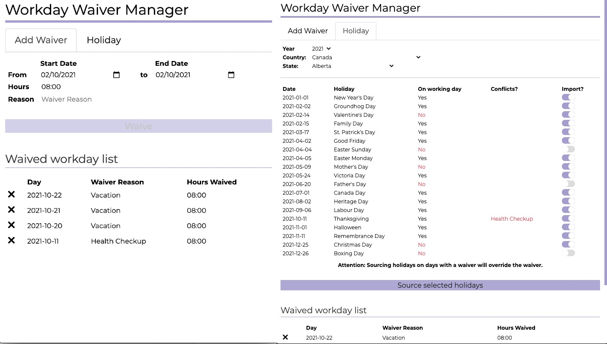

  

  
Registrera arbretstid och bli notifierad när det är dags att lämna jobbet och leva livet

[Homepage](https://timetoleave.app/)

 

    

  

   

   

---

Registrera tiden du började arbeta idag, och programmet kommer att räkna fram vilken du bör lämna kontoret, efter att ha tagit hänsyn till din tid för lunch. När det är dags, programmet kommer att notifiera dig.

Du kan styra dina preferenser, konfigurera dina arbetsdagar, hur många timmar du arbetar per dag och om du vill ha en notifiering eller inte.

Du kan också lägga till dagar du är ledig, dagar du inte arbetar.

## Hur man installerar TTL

Time to Leave fungerar på MacOS, Windows och Linux, och du kan ladda ned den version du önskar från [den senaste releasen](https://github.com/thamara/time-to-leave/releases/latest).

## Hur man bygger och bidrar till TTL

Om du vill hjälpa till, läs vår [att bidra](CONTRIBUTING.md) guidelines.
Du kan också läsa vår [utvecklarguide](DEVELOPMENT.md) för mer information.

## Ta kontakt!

Gå med vår  [Discord server](https://discord.gg/P3KkEF5) för att diskutera kommande funktioner och mer.

## Eftertexter

Ikoner är gjorda av [freepik](https://www.flaticon.com/authors/freepik) från [www.flaticon.com](https://www.flaticon.com).

Original Timer ikon av [lucy-g](https://icon-icons.com/icon/timer/121243), färglagda varianter och format modifierade från detsamma.

Sick ikon av [SVG Repo](https://www.svgrepo.com/svg/271898/sick).

Vyväxlare ikon gjord av [Pixel perfect](https://www.flaticon.com/authors/pixel-perfect) från [www.flaticon.com](https://www.flaticon.com).
